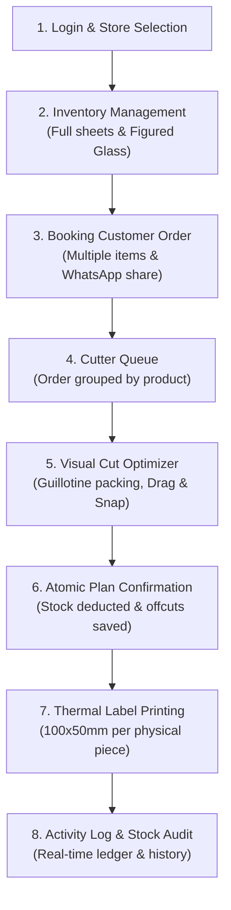

# Fakhri Glass — End-to-End Testing & User Flow Guide

This document outlines the complete, step-by-step user journey for testing the Fakhri Glass Android application from start to finish.

---

## 1. System Roles & Test Accounts

The system supports three user profiles. All staff members have full visibility across shop operations, while their specific assignment customizes default screen routing, store filters, and activity attribution:

| Name | Role / Assignment | Email | Default Landing Tab | Default Store Filter |
| :--- | :--- | :--- | :--- | :--- |
| **Murtuza** | Mumbai Counter Staff | `murtuza@...` | **Orders** | Mumbai |
| **Qutub** | Sanpada Counter Staff | `qutub@...` | **Orders** | Sanpada |
| **Hussain** | Glass Cutter | `hussain@...` | **Cut** | All |

> **Note on Store Assignment:** Stores are strictly `Mumbai` and `Sanpada`. `Cutter` is an operational assignment/role, never a physical store location, and is excluded from store dropdowns and piece labels.

---

## 2. High-Level Flow Diagram

---

## 3. Step-by-Step Walkthrough

### Step 1: Login & Navigation
1. Launch the app on an Android device or emulator.
2. Sign in using a Counter staff account (e.g., `murtuza@...` or `qutub@...`).
3. **What to verify:**
   - The app navigates directly to the **Orders** tab (or **Home** tab).
   - In the header or user profile, verify the store assignment tag matches the account: **"Mumbai"** or **"Sanpada"**.
   - Review the bottom navigation bar with 5 primary tabs: **Home**, **Inventory**, **Orders**, **Cut**, and **Settings**.

---

### Step 2: Inventory Management (Adding Sheets & Offcuts)
1. Tap the **Inventory** tab.
2. Review existing stock grouped by Categories (Clear Glass, Mirror Glass, Tinted Glass, Figured Glass, etc.).
3. Tap the **"+ Add Stock"** button:
   - **Scenario A (Standard Clear Glass):**
     - Category: `Clear Glass` $\rightarrow$ Product: `5 mm Clear Glass`.
     - Source: `Full Sheet`.
     - Width: `2440 mm` (or toggle unit to `8 ft 0 in`).
     - Height: `1830 mm` (or `6 ft 0 in`).
     - Quantity: `2` $\rightarrow$ Tap **Add Stock**. (Two physical stock rows are created).
   - **Scenario B (Figured / Lining Glass with Fluting):**
     - Category: `Figure Glass (lining)` $\rightarrow$ Product: `5 mm Clear Moru`.
     - Notice the required field: **Vertical Line Height**.
     - An informational notice explains: *"Lining glass requires vertical line height to ensure cuts align with the texture/grain flutes."*
     - Enter Line Height: `1830 mm` $\rightarrow$ Tap **Add Stock**.
4. **Dimension Toggle:**
   - Tap the **"mm / ft-in"** toggle at the top of the inventory screen to verify dimensions convert accurately between millimetres and feet/inches (`2440 mm` $\leftrightarrow$ `8' 0"`).

---

### Step 3: Booking a Customer Order
1. Switch to the **Orders** tab.
2. Tap the floating **"+ New Order"** button.
3. Fill in Customer Details:
   - **Customer Name:** e.g., `Ahmed Interior Decorators`
   - **Phone Number:** e.g., `9876543210`
   - **Delivery Date:** Select a date.
4. **Store Selection:**
   - Observe the Store dropdown provides strictly **Mumbai** or **Sanpada** (defaulting to the active user's assigned store, but selectable).
5. **Add Order Items:**
   - **Item 1:**
     - Product: `5 mm Clear Glass`
     - Width: `600 mm` | Height: `900 mm`
     - Quantity: `3`
     - Unit Price: `₹450` $\rightarrow$ Tap **Add Item**.
   - **Item 2:**
     - Product: `5 mm Clear Moru` (Figured Glass)
     - Width: `500 mm` | Height: `800 mm`
     - Quantity: `2`
     - Unit Price: `₹600` $\rightarrow$ Tap **Add Item**.
6. **Payment & Notes:**
   - Order total is calculated automatically.
   - Enter **Advance Paid:** `₹1,000`.
   - Payment Method: Select `UPI`, `Cash`, `Card`, etc.
   - Notes: e.g., `Polished edges requested`.
7. Tap **"Create Order"**:
   - Order is saved atomically with a sequential order number (e.g., **Order #1001**).
   - Initial status is set to **`New`**.
8. **WhatsApp Share:**
   - Tap the created order to open the **Order Detail** screen.
   - Tap **"Send to WhatsApp"**: Opens WhatsApp with a pre-formatted message listing the store, customer name, line items with dimensions, total, and balance due.

---

### Step 4: Cutter Queue
1. Log out (Settings $\rightarrow$ Log out) and log in as **Hussain** (`hussain@...`), or tap directly on the **Cut** tab.
2. Because Hussain's assignment is `cutter`, the app opens straight onto the **Cut** screen.
3. Review the **Cutting Queue**:
   - Tasks are grouped by **Order #** and **Product** (e.g. `Order #1001 · 5 mm Clear Glass` and `Order #1001 · 5 mm Clear Moru`).
   - Each card displays customer name, store badge (`Mumbai`), total pieces count, and ready status.
4. Tap on the task for **`Order #1001 · 5 mm Clear Glass`** to enter the cutting workspace.

---

### Step 5: Visual Cutting Optimiser & Skia Canvas
1. **Automated Guillotine Layout:**
   - The layout engine automatically proposes an optimal cutting plan.
   - Existing **usable offcuts are prioritized first** before consuming a new full sheet.
   - Edge-to-edge guillotine cut lines are rendered directly on the sheet.
2. **Visual Legend on Canvas:**
   - **Blue Rectangles:** Placed order pieces with dimensions and item labels.
   - **Thin Red Lines:** Kerf allowance (blade scoring loss, default 3 mm).
   - **Green Dashed Areas:** Usable offcuts that will be returned to inventory.
   - **Gray Crosshatched Areas:** Waste / scrap trim.
3. **Interactive Gestures & Testing:**
   - **Drag & Magnetic Snapping:** Touch and drag any piece. As it nears sheet edges or neighboring pieces, it snaps cleanly into place respecting kerf spacing.
   - **Live Collision Warning:** Drag a piece on top of another piece. Both pieces immediately highlight in **bright red** with a collision alert, and the wastage badge indicates a collision error.
   - **Rotation:**
     - Standard Glass: Tap a piece's rotate button to swap width and height.
     - Figured Glass (Moru): The rotate button is disabled/hidden with an alert: *"Figured lining glass cannot be rotated"*, preserving vertical fluting alignment.
   - **Unplaced Pieces Tray:** Drag a piece off the sheet into the bottom tray, or drag pieces back onto any sheet.
   - **Multi-Sheet Switcher:** Switch between `Sheet 1`, `Sheet 2`, or tap `+ Add Blank Sheet` to pull another available sheet from stock.
   - **Cut Settings Modal:** Tap the settings gear icon to adjust Kerf width (mm), Minimum usable offcut size (mm), or Maximum wastage %.

---

### Step 6: Confirm Cut Plan (Atomic Stock Deduction)
1. Ensure all pieces are placed on sheets with **zero collisions**.
2. Tap the blue **"Confirm Cut Plan"** button:
   - A summary dialog displays:
     - Total pieces to cut
     - Full sheets consumed
     - Usable offcuts created
3. Tap **"Confirm & Deduct Stock"**:
   - The transaction executes atomically via the `confirm_cut_plan` database procedure:
     - The used full sheet is marked `status = 'consumed'`.
     - The remaining usable glass is saved as a new offcut in `stock_items` with a link to its parent sheet.
     - Order status transitions from **`new`** $\rightarrow$ **`cutting`** (or **`cut`**).

---

### Step 7: Thermal Piece Label Printing (100 × 50 mm)
1. Following confirmation, a prompt appears:
   > *"Order #1001 plan confirmed. Stock has been deducted and offcuts added to inventory. Print piece labels now?"*
2. Tap **"Print Labels"** (or open Order Detail at any time and tap **"Print Labels"** / **"Share PDF"**).
3. **Verify the Label Output:**
   - Format: Direct 100 × 50 mm (4" × 2") thermal roll standard.
   - **One Label per Physical Piece:** For an item with Quantity = 3, **3 distinct labels** are generated, numbered:
     - `Piece 1/3`
     - `Piece 2/3`
     - `Piece 3/3`
   - **Label Content:**
     - Store Header: `FAKHRI GLASS · MUMBAI` (Never displays 'cutter').
     - Order Information: `Order #1001`
     - Customer Name: `Ahmed Interior Decorators`
     - Product Name: `5 mm Clear Glass`
     - Sizing: Dual readout, e.g. `600 × 900 mm (1'11⅝" × 2'11⁷/₁₆")`
4. The system triggers the native Android print dialog or allows sharing the PDF directly via WhatsApp or cloud storage.

---

### Step 8: Audit & Verification
1. Tap the **Settings** tab.
2. Tap **"Activity Log"**:
   - Review the complete chronological log:
     - `Murtuza · Mumbai logged in`
     - `Order #1001 created`
     - `Cut plan confirmed for Order #1001`
     - `Labels printed for order #1001`
3. Return to the **Inventory** tab:
   - Verify the original full sheet is marked consumed.
   - Verify the new offcut(s) (e.g. `1240 × 930 mm Offcut`) now appear in available stock, ready for future jobs.

---

## 4. Key Rules & Operational Notes

- **Lining Glass (Figured Glass):** Always has fluting/grain running vertically. Mandatory vertical line height is enforced upon creation, and rotation is blocked on the cutting canvas.
- **Stock Integrity:** Physical glass stock is only deducted through the server-side `confirm_cut_plan` transaction. Pieces cannot be double-allocated.
- **Accidental Deletions:** Inventory items cannot be hard deleted. Deletion moves them to `removed` status after confirmation, preserving historic audit trails.
